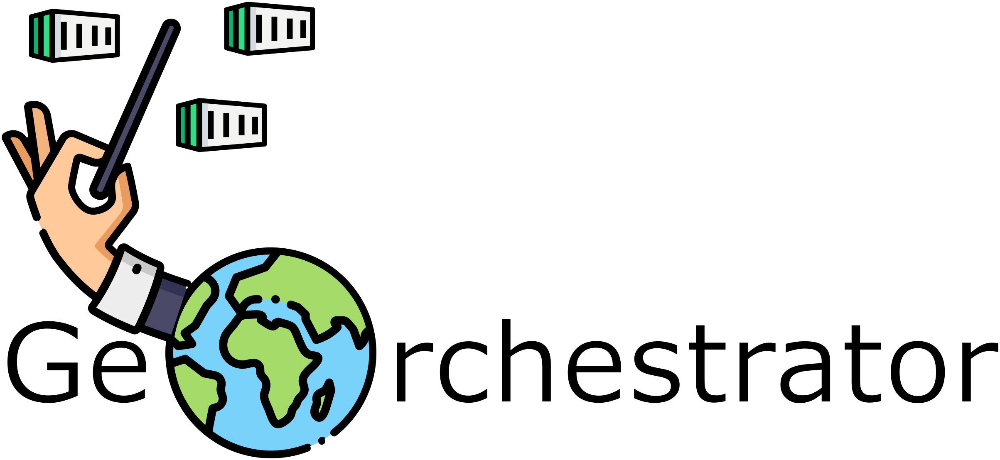

# GeOrchestrator



This project was developed as a part of PhD study. This project allows running 
geospatial workflows on serverless services provided by a cloud provider. It supports 
sequential, parallel, and loop executions. In addition, a new workflow and task definition 
models were introduced to design workflows in a simple, versionable, and readable way. 

## Usage

At the moment, it only works on AWS and local docker deployment. Other platforms are welcomed as pull requests.

### AWS Deployment

The project uses Pulumi for infrastructure as code (IaC) to deploy resources on AWS. Follow these steps to deploy the application:

1. Install Pulumi:
   - For Windows (PowerShell):
     ```powershell
     winget install Pulumi
     ```
   - For macOS (Homebrew):
     ```bash
     brew install pulumi
     ```
   - For Linux:
     ```bash
     curl -fsSL https://get.pulumi.com | sh
     ```

2. Configure AWS credentials:
   - Install and configure AWS CLI
   - Run `aws configure` and enter your AWS credentials
   - Ensure you have appropriate permissions for creating resources

3. Deploy the infrastructure:
   Navigate to the deployment directory and run the deployment script:
   ```powershell
   cd ./deployments/GEOrchestrator.Aws.Deployment
   ./Deploy.ps1
   ```

This will create the following AWS resources:
- Lambda functions for API endpoints
- DynamoDB tables (on-demand)
- Fargate cluster with required network components
- API Gateway
- S3 buckets for workflow storage

The deployment script will output the API endpoint URL once completed.

### Docker Deployment

Under the root folder, run the following command to start the application:

```bash
docker compose up -d --build
```

The application will use default configuration values. If you need to customize the configuration, you can modify the environment variables in the `docker-compose.yml` file.

The API will be started on: `http://localhost:8000`

### Example: Running Raster Calculations

The raster calculations workflow is provided as an example to demonstrate how the system works. It shows how to define, build, and execute a workflow using the GEOrchestrator system.

To run the example raster calculations workflow:

1. Make sure you are in the root folder of the project and run the build script:

For PowerShell:
```powershell
./definitions/raster-calculations/build_and_run.ps1
```

For bash:
```bash
chmod +x ./definitions/raster-calculations/build_and_run.sh
./definitions/raster-calculations/build_and_run.sh
```

2. Once the workflow is created, you can execute it using cURL (for bash) or PowerShell. Here's an example of executing a reprojection workflow:

For bash:
```bash
curl --location 'http://localhost:8000/processes/ReprojectDemsParallel/execution' \
--header 'Content-Type: application/json' \
--data '{
    "inputs": {
        "dems": "[\"https://geo-public-assets.s3.eu-west-1.amazonaws.com/asciis/sample_1.asc\",\"https://geo-public-assets.s3.eu-west-1.amazonaws.com/asciis/sample_2.asc\"]",
        "source_projection": "EPSG:4326",
        "target_projection": "EPSG:3759"
    }
}'
```

For PowerShell:
```powershell
$body = @{
    inputs = @{
        dems = '["https://geo-public-assets.s3.eu-west-1.amazonaws.com/asciis/sample_1.asc","https://geo-public-assets.s3.eu-west-1.amazonaws.com/asciis/sample_2.asc"]'
        source_projection = 'EPSG:4326'
        target_projection = 'EPSG:3759'
    }
} | ConvertTo-Json

Invoke-RestMethod -Uri 'http://localhost:8000/processes/ReprojectDemsParallel/execution' `
    -Method Post `
    -ContentType 'application/json' `
    -Body $body
```

This example demonstrates how to execute a parallel DEM reprojection workflow. Adjust the inputs according to your specific workflow requirements.

## Contributing
Pull requests are welcome. For major changes, please open an issue first to discuss what you would like to change.

Please make sure to update tests as appropriate.

## Publications

Pakdil, M.E.; Celik, R.N. Serverless Geospatial Data Processing Workflow System Design. 
ISPRS Int. J. Geo-Inf. 2022, 11, 20. https://doi.org/10.3390/ijgi11010020

## License
[Apache License 2.0](https://choosealicense.com/licenses/apache-2.0/)

[](https://zenodo.org/badge/latestdoi/325787241)